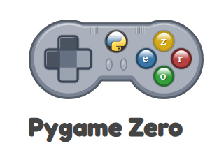

# PGZERO

## What are the differences between Pygame Zero and Pygame?

#### Pygame Zero is a simplified version of Pygame, designed to be more beginner-friendly by providing a higher level of abstraction, requiring less code setup and boilerplate, and focusing on ease of use, particularly for educational purposes, while Pygame offers more flexibility and control for experienced game developers who want to manage low-level details themselves. 

Games created:

<ul>
<li><a href=".Games/Gem Catcher">Gem Catcher</a></li>
<li>Ninja Runner</li>
</ul>